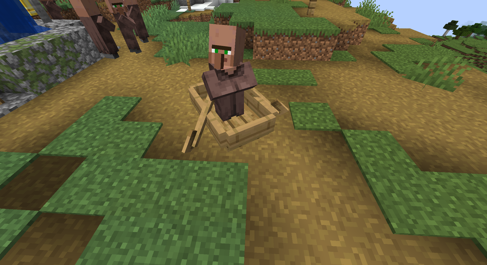

### Fast and Furious: Boatyo Drift

Show off your drifting skills and leave the water:

### Boats can now go upwards, up to half a block!

Know that feeling when you get stuck even on simple paths?  

Just get over it:

### The ice family is complete!

New cool slabs and stairs for all ice types:  

### Fixes Bugs

Fixes [MC-172884](https://bugs.mojang.com/browse/MC-172884 "Boats cannot move up to the tiny step of blocks") and
implements [MC-260445](https://bugs.mojang.com/browse/MC-260445 "Player can climb up one block while riding a boat or raft") in a better
way.
